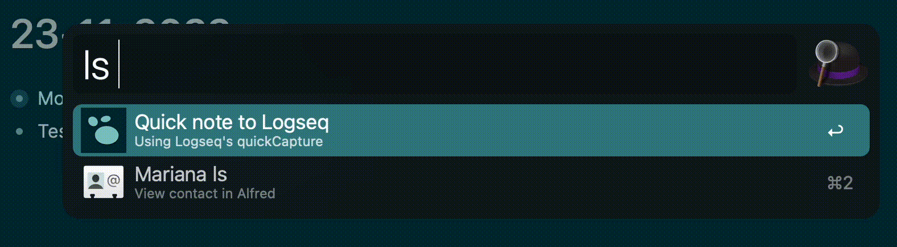

# Overview

This Alfred workflow adds a Quick Note to an already open Logseq instance using the quickCapture method.

# Installation

1. In Alfred, install this workflow after saving it to your computer.
2. If at first it doesn't work, ensure that Logseq is open, and then inspect the workflow. In the `Open URL` action, double check that the browser to `Open With` is defaulted to 'Logseq'.

# Usage

### Insert to TODAY

Open Alfred using your hotkey, and enter `ls What ever you want in your quick note`.

### Insert to specific page (available in Logseq v0.8.12 onwards)

Open Alfred using your hotkey, and enter `ls-specific-page What ever you want in your quick note`, i.e. `ls-projectA love this project`
